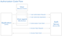

OAuth has been adopted my many organizations, large and small, as the (current) best standard for authenticating and authorizing their users. OAuth 2.0 being the latest iteration of the standard and it’s used to offload the burdensome security related parts of applications to third party experts. While writing your own OAuth flow for your apps could be a fun experience (for those of you that really enjoy headaches), most of the time we are happy plugging in a third party SDK so we can authenticate against their service.
  
In the NativeScript world, we could use third party SDKs, or we could simply use the new OAuth plugin available on NPM. Here’s how you can start.
  

#### Versions used in this post 

* NativeScript: 2.1.1
* nativescript-oauth plugin: 0.0.2 (you can find the latest version [here](https://www.npmjs.com/package/nativescript-oauth))

Here’s the crux. Many APIs are secured by access tokens and the OAuth dance between servers is meant to produce one of these tokens that your app can send to the API you’re working with along with the regular calls you’re making. To get the access token, your user needs to login at the third party authentication website.



You want to decide what third party OAuth 2.0 provider you want to use for your users to login. If you’re writing an app that uses the Facebook API, then you’re going to need an access token provided by Facebook’s authentication servers. If you’re writing an app that uses the Microsoft Graph or Office 365, you’ll need an access token from Microsoft. And so on. Then you need to register your app with the third party provider.

#### Setup instructions for third party providers

* [Instructions on setting up your app with Facebook](https://developers.facebook.com/docs/apps/register)
* [Instructions on registering a Microsoft Live app or Office 365 app or Microsoft Graph app](https://msdn.microsoft.com/en-us/library/bb676626.aspx)

Other third party providers have similar workflows for setting up an app.

## Introducing the NativeScript OAuth plugin.

Once you’ve created your NativeScript project and have your app registered with your OAuth provider, you can install the NativeScript OAuth plugin, which is just a NPM package that is easily installed using this command 

```
tns plugin add nativescript-oauth
```

Wherever you need to use the nativescript-oauth module, you need to import it

```
import * as tnsOAuthModule from ‘nativescript-oauth’;
```

In your app.ts file (or app.js if you’re not using TypeScript), you will bootstrap your authentication provider data bits like this

### Office365/Microsoft Graph

```
var o365InitOptions : TnsOAuthOptionsOffice365 = {
    clientId: ‘e392f6aa-da5c-434d-a42d-a0e0a27d3964’, //client id for application (GUID)
    scope: [‘Files.ReadWrite’, ‘offline_access’]
};
tnsOAuthModule.initOffice365(o365InitOptions);
```

Or, if you’re using Facebook

### Facebook

```
var facebookInitOptions : TnsOAuthOptionsFacebook = {
    clientId: ‘1819818654921817’,
    clientSecret: ‘b7e58f212b51e4d639bed857171c992a’,
    scope: [‘email’]
};
tnsOAuthModule.initFacebook(facebookInitOptions);
```

**_Note:_** Make sure you do this before you execute `application.start(…)`

Notice that Microsoft only requires the ClientId and scope, but Facebook also require the ClientSecret. These are all values you should have access to when registering your app. ClientId is the identifier of your application and is some unique value. Microsoft uses UUIDs and Facebook uses long integers. Scope tells the provider what permissions your app has. I'm sure you've seen the screens that say something like "App so-and-so want to post to Facebook on your behalf"; well that's the permission level that you control with scope. Read the provider's documentation to get all the available scopes.

Once you have that done, you can call the login function whenever you need to authenticate your user. This will probably be on the login page.

```
tnsOAuthModule.login()
     .then(()=>{
       console.log(‘logged in’);
     })
     .catch((er)=>{
       console.log(er);
     });
```

The `login` function returns a JavaScript Promise object so you can listen for successful login or failures.

You can get to the access token whenever you need to pass it to the API

```
var token = tnsOAuthModule.accessToken();
```

Keep in mind that the access token will expire. While the NativeScript OAuth plugin is still under development, it doesn't auto-refresh the access token, but it will do so in the near future. Keep an eye out for any updates that will provide this functionality. Android support will also be available soon, so stay tuned.
