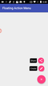

…and how is that related to plugins?
  
When you create a native mobile application involving anything more advanced than just your standard out of the box user interface controls, you inevitably run into challenges around extending your app to handle new UI interactions or animations that you could write yourself, or you could use a library that someone else developed and made available for free.
  
In this post I review some options that you have for “stepping outside the box” when it comes to creating user interface elements in your NativeScript applications.

While it’s great experience to try to write UI libraries yourself, most of the time we want to have something in our app right away and get on with our day.

NativeScript comes with lots of options for UI customization right out of the box, and for anything extra, it even allows you to call directly to the native platform, iOS or Android, to go that last mile.

While you could leverage the native calls to write all the interesting things that developers would want to create, as I show how to build a floating action button in [this series of videos](https://www.youtube.com/playlist?list=PLPwbI_iIX3aSKRjtx-0dOF6701njL-BuE), and this is really great as a learning experience, sometimes it’s much more time saving to get a ready made library that does the job for you. 

NativeScript allows you to create and use plugins for this very reason. With the release of the official plugin seed last week, it’s now a really simple matter of starting your own plugin.

Are you interested in trying this out, but don’t know how it applies to your own development efforts quite yet? We’ll take that FAB example I mentioned earlier. FABs are part of the Android material design language and they don’t come as a UI control in iOS. How do you get a floating action button in iOS? You can try building it using a variety of techniques, one of which I cover in this video series. Or you can use a [FAB iOS library](http://cocoapods.org/pods/kcfloatingactionbutton) that someone has built in your NativeScript app.

Using libraries like this is what NativeScript calls creating a plugin. It might sound scary at first, but it’s not hard. You can [read the docs](https://docs.nativescript.org/plugins/cocoapods) on how to do this, or maybe find videos on YouTube. I would also highly recommend watching [this course on NativeScripting.com](https://nativescripting.com/course/nativescript-plugins-creating-custom-view-components) by the original creator of the official NativeScript plugin seed, Nathan Walker. I watched this hour long course and managed to learn a few tips and tricks that I didn’t know.

#### About the plugins course.

[NativeScript Plugins: Creating Custom View Components](https://nativescripting.com/course/nativescript-plugins-creating-custom-view-components)

#### Author

Nathan Walker 

#### Course Description

In this course, Nathan shows how to use the official NativeScript plugin seed to create a custom view component plugin for iOS and Android.? He systematically shows how to expose a native API to JavaScript on the iOS side, then he shows how to build up the same API in Android, exposing a common plugin API to be consumed by the NativeScript application. Along the way, he shows how to determine the quality of available source CocoaPods and Gradle projects, as well as how to deal with some hurdles that you may face while building your own plugins. This short course will teach you a lot of intermediate to advanced techniques in a short amount of time, so put your attention hats on and hold on. 

There are many options for extending your user interface with custom, creative, and beautiful elements, whether to add a little extra functionality, like validation, or to add a little bit of fun, like [exploding Pokémon](https://www.youtube.com/watch?v=ySIsAKjGa4E). Using native third party libraries is easier than you think and will quickly make your NativeScript apps shine.
